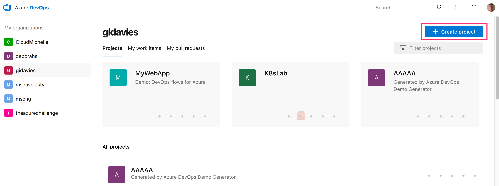
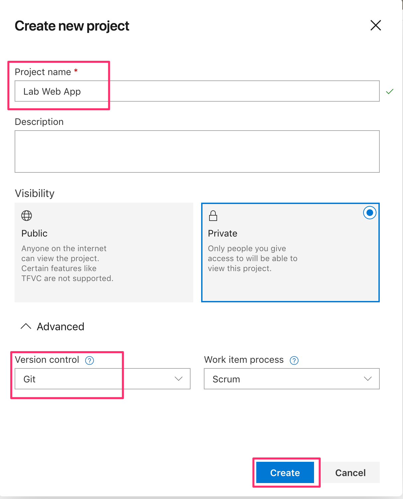
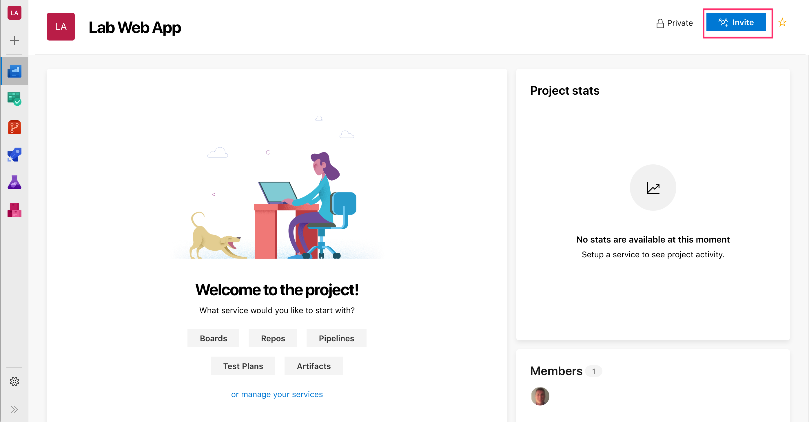
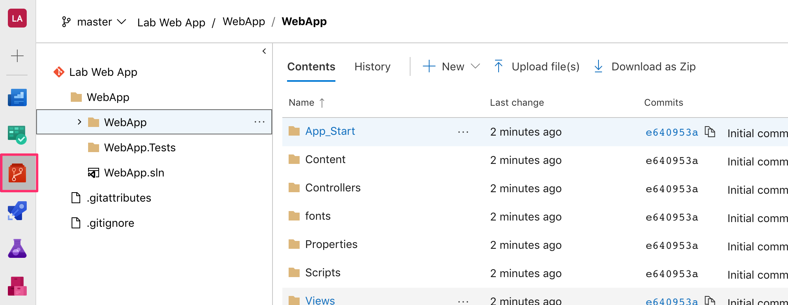

# Lab 1: Creating the project

## Task 1: Create the Azure DevOps Team Project

1. Open a browser and navigate to your Azure DevOps organisation. The old URL is  https://youraccountname.visualstudio.com and will work indefinitely or the new URL is https://dev.azure.com/yourorganisationname.
2. In your Azure DevOps organisation select Create Project.

3. Give the project a name, e.g. Web App. Make sure that version control is set to Git (select Advanced to show the options) and click Create. You could equally choose to use TFVC but this lab has documented the steps for using Git.

4. Your Azure DevOps team project has been created. You can add other people to the team if you want.

## Task 2: Cloning the Azure DevOps git repository to your local machine

An empty git repository has been created in Azure DevOps and this step will clone that to a git repository on your local machine so that you can work locally and then push to Azure DevOps when required. There are different ways of doing this (command line, clone from Azure Repos in the browser) but here we will clone from within Visual Studio.

1. Launch Visual Studio. If you haven't used Visual Studio on the machine before you will be prompted to sign in when Visual Studio starts. Sign in with the account that you are using for Azure DevOps.

2. Open the Team Explorer view (usually right hand side of the IDE ina view next to the Solution Explorer) and select Manage Connections | Connect to Project.

3. Select the Web App project (you may only have one project listed) expand it to show the Web App repository and then click Clone.

  
4. If you now open the Team Explorer (bottom right hand corner) you will see that the repository has been cloned succesfully.

## Task 3: Creating the Web Application to deploy

This step will create a sample web application using a standard Visual Studio template for simplicity.

1. Select New in the Solutions area of Team Explorer. This ensures that the app will be created in the correct location for the local git repo.

2. Select Web | ASP.NET Web Application, change the name as required and click OK.

3. Ensure that MVC is selected, disable Enable Docker if checked and check Add unit tests. Click OK.

4. When the project has been created, click the run button (green arrow) or F5 to build and launch the web application locally.

5. The web application will launch locally. Take a quick look and then close the browser.

6. To stop the debug session click the stop button or Shift + F5 in Visual Studio.

You now have a web application. The next step is to add the application to Git so that it is under source control.

## Task 4: Committing the new Web App to source control

1. In the Visual Studio Team Explorer, select Changes.

2. You may be prompted to enter or confirm your Git User Information. Just click Save and you won't be prompted again.

3. Add a commit comment, such as Initial commit, then select Commit All and Push.

4. When completed you can go back to Azure DevOps in the browser, select Repos | Files and you will see your source code. Take a look at the history to see your initial commit.

You now have a web application, committed to source control in Azure DevOps. The next step is to add an automated build that is triggered every time code is pushed to the repo - Continuous Integration.

[<- Home](https://github.com/gidavies/WebAppDevOpsLab/blob/master/README.md) | [Lab 2: Continuous Integration ->](https://github.com/gidavies/WebAppDevOpsLab/blob/master/DevOpsLab2.md)