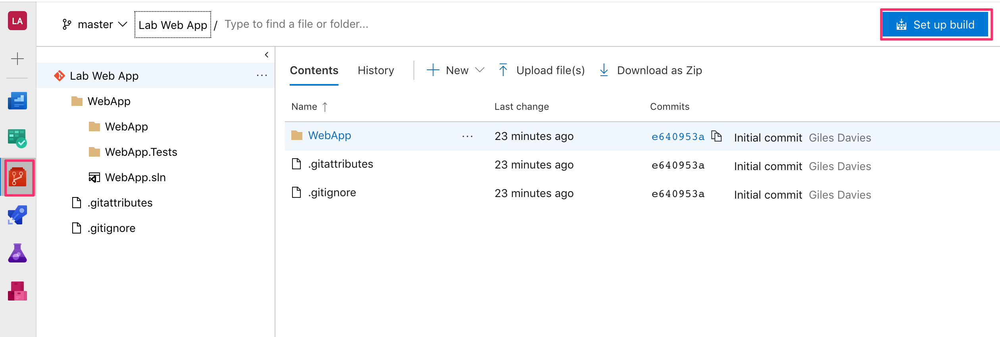
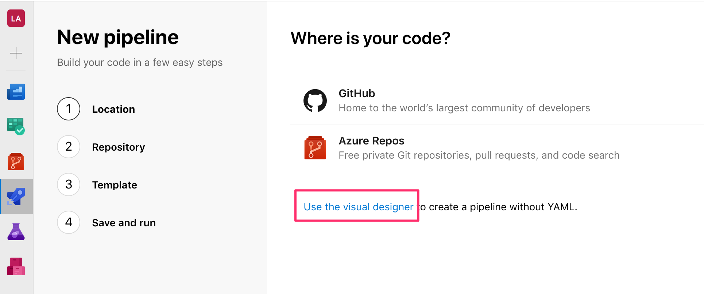
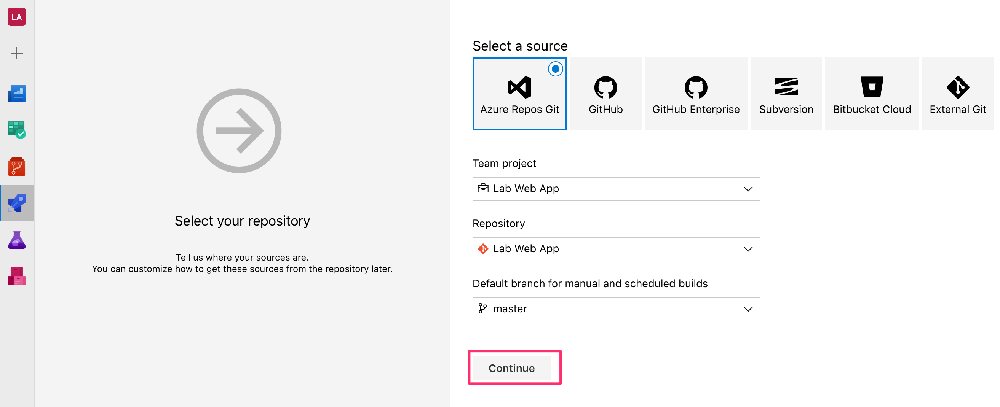
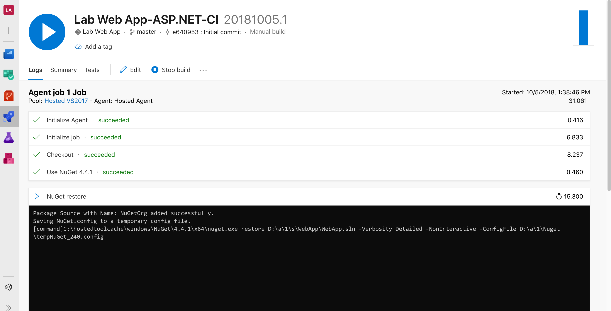
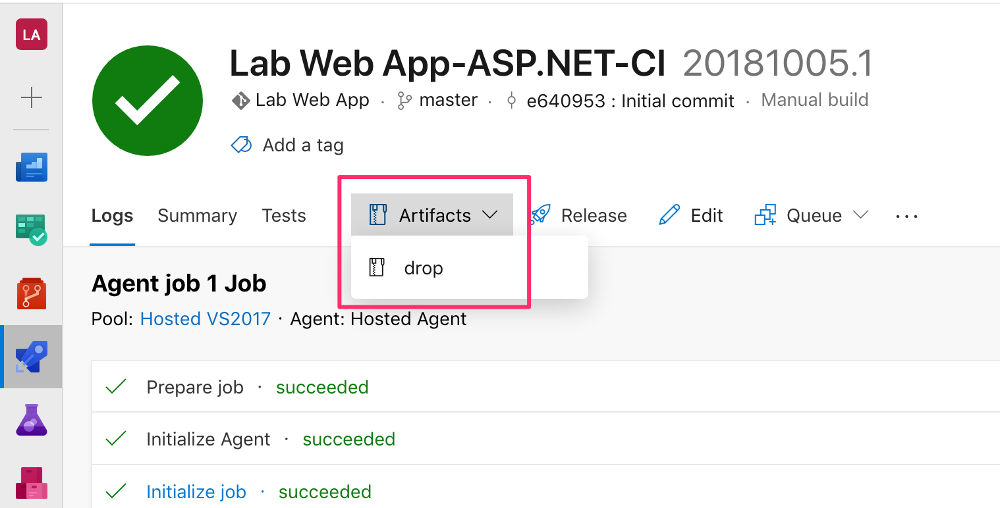
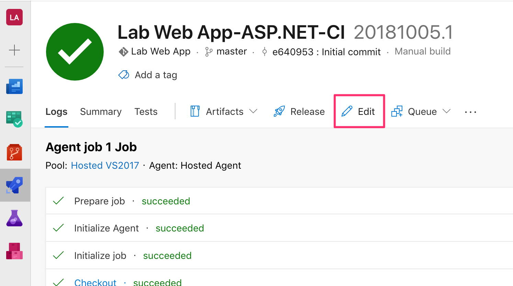
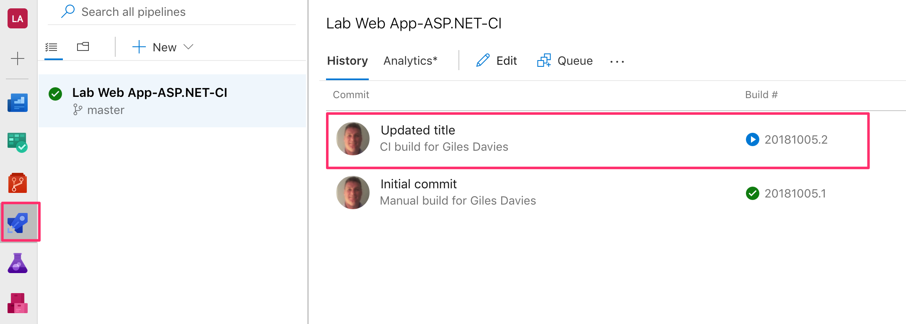

# Lab 2: Continuous Integration

Continuous Integration is a key DevOps practice to build, test and create the software to later deploy.

## Task 1: Set up the Continuous Integration definition

1. Navigate to the Azure DevOps repo, and select Set up build.

2. For this lab we will create the pipeline using the visual designer rather than YAML files. Click on the Use the visual designer link.

3. Choose the location for the git repo that the build pipeline will use as a source. In this case it is in Azure Repos, so you can keep all of the defaults and click Continue.

4. There are a range of build templates available, including non-Microsoft technologies but for this example select the ASP.NET template and click Apply.

5. The template creates a build definition with a number of tasks added. You can choose to run the builds using an on-premise agent or use the agents hosted on Azure. We will use the Hosted VS2017 agent as it has the .NET framework and all other components that are required to build the app. Check that the agent is set to Hosted 2017.

6. The template restores any dependencies using NuGet, builds the solution, runs any unit tests and then publishes the output. This should be ready to use, so for now test the build by clicking Save & Queue.

7. The next window allows you to change some inputs into the build, but just click Save & Queue.

8. You should now see that a build has been queued. Click on the build number to watch the build in progress.

9. Observe the build progressing. It will typically take a few minutes.

10. When the build completes click on the Artifacts drop down and select drop, which is the default output of the build 

11. Expand the drop folder and notice that there is a zip file created from the build task in the build definition. This is the web application, packaged as a zip file, which is an easy way to deploy to Azure. Click Close.

You now have a working build definition for the web application. The next step is to set it up with a Continuous Integration trigger and test it.

## Task 2: Enable Continuous Integration

1. Select Edit in the build result page.

2. Select Triggers and check Enable continuous integration. Save (but not queue).

3. Test the Continuous Integration trigger by returning to Visual Studio and making a change. For example open the WebApp/Views/Home/Index.cshtml and make a change such as changing the heading for the home page. Save the changes.

4. In the Team Explorer, return to the Changes hub to see the files you've changed, and add a comment and select Commit All and Push.

5. In Azure DevOps, navigate to the Builds (Pipelines | Builds) and you should now see a build in progress. If you want to click on the build to watch the build. 

You now have a build triggered whenever you make a change to the code and push that change to Git in Azure DevOps - Continuous Integration is in place for the project.

>Optional challenge: Add a Build History widget to the Overview dashboard:
>- Navigate to the dashboards and open the default overview dashboard 
>- Edit the dashboard and add the build history widget:
>- Configure the widget to point to the build definition created in the preceding steps

[<- Lab 1: Creating the project](https://github.com/gidavies/WebAppDevOpsLab/blob/master/DevOpsLab1.md) | [Home](https://github.com/gidavies/WebAppDevOpsLab/blob/master/README.md) | [Lab 3: Create an Azure Web App ->](https://github.com/gidavies/WebAppDevOpsLab/blob/master/DevOpsLab3.md)