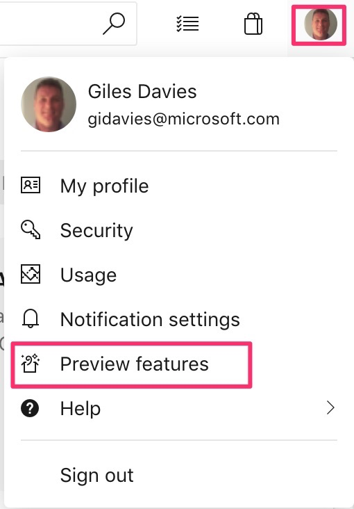
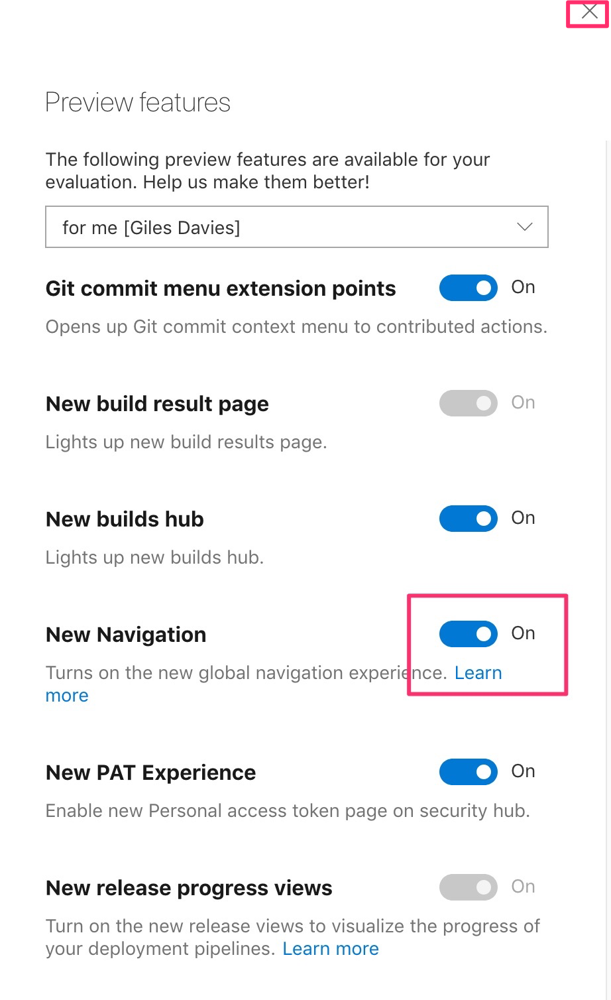

# Web App DevOps Lab

This lab will step through the key elements in setting up a DevOps pipeline using Azure DevOps, previously known as Visual Studio Team Services (VSTS). What was VSTS has now been separated into a suite of tooling including Azure Repos and Azure Pipelines which will be primarily used in this lab.

>Background information

>[Understanding the change from VSTS to Azure DevOps](https://azure.microsoft.com/en-us/blog/introducing-azure-devops/)

>[What is DevOps?](https://www.visualstudio.com/learn/what-is-devops/)

>[How Microsoft does DevOps](https://www.visualstudio.com/learn/devops-at-microsoft/)

# Overall flow

- [Lab 1: Creating the project](https://github.com/gidavies/WebAppDevOpsLab/blob/master/DevOpsLab1.md)
- [Lab 2: Continuous Integration](https://github.com/gidavies/WebAppDevOpsLab/blob/master/DevOpsLab2.md)
- [Lab 3: Create an Azure Web App](https://github.com/gidavies/WebAppDevOpsLab/blob/master/DevOpsLab3.md)
- [Lab 4: Continuous Deployment](https://github.com/gidavies/WebAppDevOpsLab/blob/master/DevOpsLab4.md)
- [Lab 5: Infrastructure as Code](https://github.com/gidavies/WebAppDevOpsLab/blob/master/DevOpsLab5.md)
- [Lab 6: Automated Testing with Selenium](https://github.com/gidavies/WebAppDevOpsLab/blob/master/DevOpsLab6.md)
- [Lab 7: Monitoring with Application Insights](https://github.com/gidavies/WebAppDevOpsLab/blob/master/DevOpsLab7.md)

Azure DevOps supports any app and doesn't require the use of Visual Studio, .NET or other Microsoft languages or platforms. [Labs that work through implementing DevOps with Node, Java, Eclipse, IntelliJ, Docker and more are available here](https://www.azuredevopslabs.com/).

# Other tasks

This lab outlines the key practices in implementing a DevOps pipeline but there are many other tasks that could be added, and you may wish to look into as additional steps after the lab:
- Setting pre and post approvals on release environments
- Using variables in releases across environment
- Adding load testing to the flow
- Linking changes to user stories and other work items in Azure Boards to understand what has been built and released.
- Using Git branches and merging via Pull Requests in Azure Repos

# Preparing for the lab

For this lab you will require:

- An Azure DevOps organisation (formerly known as a VSTS account).
- An Azure subscription (your own or a free trial).
- Visual Studio 2017 (any edition) installed.

Use the same account (login/email and password) for both Azure DevOps and Visual Studio.

If you don't have one create a free [Azure DevOps organisation](http://dev.azure.com). [Guidance for creating an organisation](https://docs.microsoft.com/en-us/azure/devops/user-guide/sign-up-invite-teammates?view=vsts).

# Using the New Navigation UI

In order to have a single flow this lab assumes that you will use the New Navigation UI that is in preview in Azure DevOps. If you create a new organisation it will be on by default, if you have an existing one then to match the labs you will need to enable this preview feature (and you can disable it after the lab to return to the old UI if preferred).

To enable the New Navigation follow these steps:

1. In Azure DevOps, in the top right hand corner click on your profile picture (or initials if no photo), and then select Preview features.

2. Turn on the toggle for the New Navigation and click on the X close button to close the preview features

The UI should then reload and you will be using the New Navigation. To turn off the New Navigation repeat the above and untoggle the feature.

[Lab 1: Creating the project ->](https://github.com/gidavies/WebAppDevOpsLab/blob/master/DevOpsLab1.md)

